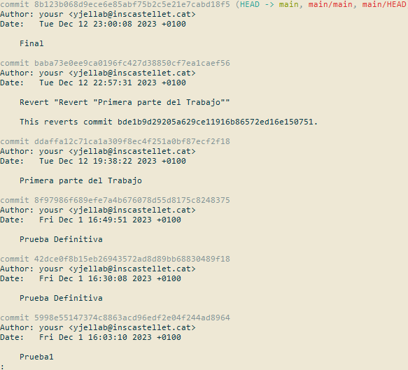

# Contribute to a project

## Repo shareable
### To make the repository shareable, it is necessary:
1. Open your repository settings in GitHub 2.
2. Add your partner in “Add People” and search for their username or email.
3. Have the partner check GitHub and they should already have it, if not check their Gmail.

#### *Foto*

## Clone in Git Extensions
### To make the repository clone locally with Git Extensions:
1. Open start and click on “Clone repository” 
2. Add the repository you want to clone and choose its destination.
3. Click on the clone button and you are all set.

#### *Foto*

#### HISTORIAL GIT EXTENSIONS
